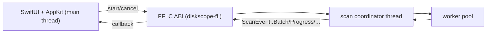

# Native macOS frontend (`ui-native`)

## Scope

`ui-native` is an alternative frontend for `diskscope`.

- `diskscope ui` remains `egui`.
- `diskscope ui-native` launches `DiskscopeNative.app`.
- Both consume shared Rust scan semantics from `diskscope-core`.

## Architecture



### Threading model

- Rust side:
  - coordinator owns authoritative mutable `ScanModel`.
  - worker threads scan subtrees and emit results.
  - coordinator emits incremental events.
- Swift side:
  - FFI callback decodes event payload immediately.
  - decoded events are dispatched to main thread.
  - UI applies patches in-place (stable node identity for selection/zoom sync).

### Ownership/lifetime

- C ABI callback payload pointers are only valid during callback.
- Swift copies patch data/string table before callback returns.
- session lifecycle is explicit: start/cancel/free.

## Build and run

From repo root:

```bash
cargo build -p diskscope-ffi --release
xcodebuild \
  -project native/macos/DiskscopeNative/DiskscopeNative.xcodeproj \
  -scheme DiskscopeNative \
  -configuration Release \
  -derivedDataPath native/macos/DiskscopeNative/build \
  build
cargo run -p diskscope -- ui-native --path / --start
```

## Xcode target notes

- project path:
  - `native/macos/DiskscopeNative/DiskscopeNative.xcodeproj`
- minimum deployment target:
  - macOS 13.0
- bridging header:
  - `DiskscopeNative/DiskscopeNative-Bridging-Header.h`
- C header include path:
  - `crates/diskscope-ffi/include`
- Rust FFI build phase:
  - runs `cargo build -p diskscope-ffi --release`

## Troubleshooting

### `ui-native` says app bundle not found

Build using the exact command above with `-derivedDataPath native/macos/DiskscopeNative/build`.

### Linker cannot find `-ldiskscope_ffi`

Run:

```bash
cargo build -p diskscope-ffi --release
```

Then rebuild in Xcode.

### Header import failures

Confirm `crates/diskscope-ffi/include/diskscope_ffi.h` exists and target header search path contains:

- `$(SRCROOT)/../../../crates/diskscope-ffi/include`
