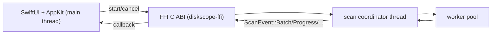

# Native macOS frontend (`ui-native`)

## Scope

`ui-native` is an alternative frontend for `diskscope`.

- `diskscope ui` remains `egui`.
- `diskscope ui-native` builds and launches `DiskscopeNative.app`.
- Both consume shared Rust scan semantics from `diskscope-core`.

## Paid daemon notes

The paid background detector lives outside this repo under `pro/diskscope-pro-daemon` (a private submodule). App Store builds pull and compile that module while OSS builds omit or stub it. The native UI always shows the `Buy Full Version` CTA; in the App Store build it launches the StoreKit one-time purchase flow and unlocks the daemon when the receipt validates, while OSS builds route the CTA to an explanation modal that links to the App Store version. To configure the submodule in environments where you have permission, run:

```bash
git submodule add <PRIVATE_REPO_URL> pro/diskscope-pro-daemon
git submodule update --init --recursive pro/diskscope-pro-daemon
``` 

Update it with

```bash
git submodule update --remote pro/diskscope-pro-daemon
```

## Screen model

- Setup screen:
  - choose mounted drive from native cards.
  - view per-drive `Capacity / Used / Free`.
  - optionally choose custom folder (`Select Folder…`).
  - set profile and open advanced tuning via `Advanced…` modal sheet before scan.
- Results screen:
  - progress/status.
  - collapsible hierarchy + treemap panes.
  - actions: `Cancel`, `Rescan`, `Change Target`.
- launch routing:
  - `ui-native` => Setup.
  - `ui-native --start --path PATH` => Results + immediate scan.

## Architecture



### Threading model

- Rust side:
  - coordinator owns authoritative mutable `ScanModel`.
  - worker threads scan subtrees and emit results.
  - coordinator emits incremental events.
- Swift side:
  - FFI callback decodes event payload immediately.
  - decoded events are dispatched to main thread.
  - UI applies patches in-place (stable node identity for selection/zoom sync).
  - treemap layout runs off-main-thread and streams progressive depth frames back to main.
  - layout jobs are generation-cancelled when newer model updates arrive.

### Ownership/lifetime

- C ABI callback payload pointers are only valid during callback.
- Swift copies patch data/string table before callback returns.
- session lifecycle is explicit: start/cancel/free.

## Build and run

### Local install script (recommended)

From repo root:

```bash
./scripts/install-native-app.sh --clean
```

Behavior:
- builds `DiskscopeNative.app` with deterministic `xcodebuild` derived data path.
- installs bundle to `~/Applications/DiskscopeNative.app`.
- launches installed app.

Common options:

```bash
# install into /Applications
./scripts/install-native-app.sh --system --clean

# keep current build artifacts, reinstall app only
./scripts/install-native-app.sh --no-open
```

Relaunch installed app:

```bash
open -a "$HOME/Applications/DiskscopeNative.app"
```

If the app was removed, rerun the install script.

### Manual build

From repo root:

```bash
cargo run -p diskscope -- clean-native
cargo build -p diskscope-ffi --release
xcodebuild \
  -project native/macos/DiskscopeNative/DiskscopeNative.xcodeproj \
  -scheme DiskscopeNative \
  -configuration Release \
  -derivedDataPath native/macos/DiskscopeNative/build \
  build
cargo run -p diskscope -- ui-native --path / --start
```

Notes:
- `diskscope clean-native` removes stale native artifacts (`native/macos/DiskscopeNative/build` and local app copy).
- `diskscope ui-native` runs deterministic `xcodebuild` (Debug, fixed `-derivedDataPath`) before launch.
- launch target is deterministic: `native/macos/DiskscopeNative/build/Build/Products/Debug/DiskscopeNative.app`.

## Runtime behavior notes

- Progress is shown as: scanned bytes / occupied bytes, with total capacity shown alongside.
- Root node size updates incrementally (`Partial`) while workers complete subtrees.
- During scan, treemap relayout is throttled and adaptive (`~1-3s`) using patch-backlog signals.
- Top bar exposes aggregate `Error` and `Deferred` counts so incomplete coverage is explicit.
- In hierarchy size column, per-node status is shown as icons with hover tooltips (error/deferred), not badge text.
- Errors can be reviewed in a dedicated `Scan Errors` window (results button or `Show Scan Errors` menu command).
- App lifecycle:
  - single main window.
  - closing window does not quit app.
  - Dock reopen restores the main window and routes to Setup or Results by app mode.
  - Dock icon shows a progress bar overlay while scanning and clears on terminal states.
- Menus:
  - File: `Select Folder…`, `Start Scan`, `Cancel Scan`, `Rescan`, `Close Window`.
  - View: `Show Setup`, `Show Results`, `Show Scan Errors`, `Reset Zoom`.
  - Window menu remains standard macOS window commands.

## Xcode target notes

- project path:
  - `native/macos/DiskscopeNative/DiskscopeNative.xcodeproj`
- minimum deployment target:
  - macOS 13.0
- bridging header:
  - `DiskscopeNative/DiskscopeNative-Bridging-Header.h`
- C header include path:
  - `crates/diskscope-ffi/include`
- Rust FFI build phase:
  - runs `cargo build -p diskscope-ffi --release`

## Troubleshooting

### `ui-native` says app bundle not found

Build using the exact command above with `-derivedDataPath native/macos/DiskscopeNative/build`.

### `ui-native` launches an older native build

Run a deterministic clean and relaunch:

```bash
cargo run -p diskscope -- clean-native
cargo run -p diskscope -- ui-native
```

### Linker cannot find `-ldiskscope_ffi`

Run:

```bash
cargo build -p diskscope-ffi --release
```

Then rebuild in Xcode.

### Header import failures

Confirm `crates/diskscope-ffi/include/diskscope_ffi.h` exists and target header search path contains:

- `$(SRCROOT)/../../../crates/diskscope-ffi/include`

### App shows `FFI ABI mismatch`

- Native app and Rust FFI were built from different revisions.
- Rebuild both:

```bash
cargo build -p diskscope-ffi --release
xcodebuild -project native/macos/DiskscopeNative/DiskscopeNative.xcodeproj -scheme DiskscopeNative -configuration Debug -derivedDataPath native/macos/DiskscopeNative/build build
```
